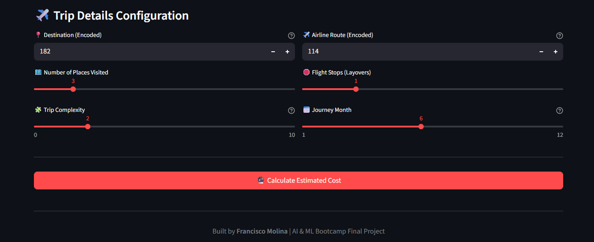

# ✈️ AI Travel Package Predictor

> ML-powered travel app that predicts package costs and detects VIP clients — built with Streamlit, Gradient Boosting, and real business logic.


---

## 📋 Table of Contents

- [Project Overview](#-project-overview)
- [Problem Statement](#-problem-statement)
- [Dataset](#-dataset)
- [Features Used](#-features-used)
- [Model Performance](#-model-performance)
- [App Features](#-app-features)
- [Screenshots](#-screenshots)
- [Key Findings & Challenges Overcome](#-key-findings--challenges-overcome)
- [Tech Stack](#-tech-stack)
- [Project Structure](#-project-structure)
- [How to Run Locally](#-how-to-run-locally)
- [Live Demo](#-live-demo)
- [Author](#-author)

---

## 🌍 Project Overview

**Student:** Francisco Molina  
**Course:** AI & ML Bootcamp — Individual Capstone Project  
**Dataset:** Workation Price Prediction Challenge (MachineHack)

This project demonstrates an **end-to-end Machine Learning pipeline**, from exploratory data analysis and preprocessing, through model training and optimization, to deploying a business-ready web application with interactive predictions.

---

## 🎯 Problem Statement

Travel companies need to:

1. **Accurately price group trips** — Manual quoting is slow and inconsistent. A regression model provides instant, data-driven cost estimates based on itinerary complexity.
2. **Quickly identify potential VIP clients** — High spenders represent the most valuable segment but are a minority in the data. A classification model tuned for high recall ensures premium leads are rarely missed.

This project solves both problems by predicting exact travel package costs for fast quoting, and classifying travelers into spending tiers (Low, Medium, High Spender) to optimize upselling strategies and maximize revenue.

---

## 📊 Dataset

| Detail | Value |
|--------|-------|
| **Source** | Workation Price Prediction Challenge (MachineHack) |
| **Records** | ~16,000+ travel itineraries |
| **Target (Regression)** | Travel Package Price (Continuous) |
| **Target (Classification)** | Spending Tier — Low / Medium / High Spender (Categorical, binned from price) |

---

## 🔧 Features Used

| # | Feature | Type | Description |
|---|---------|------|-------------|
| 1 | `Destination` | Label Encoded | 565 unique destination route combinations |
| 2 | `Airline` | Label Encoded | 314 unique airline route combinations |
| 3 | `Journey_Month` | Numeric (1-12) | Month of travel |
| 4 | `Num_Places_Visited` | Numeric | Number of destinations in the itinerary |
| 5 | `Flight Stops` | Numeric | Number of layovers |
| 6 | `Trip_Complexity` | Engineered | Composite score representing itinerary complexity |

---

## 📈 Model Performance

### Regression Model — Gradient Boosting Regressor

| Metric | Score |
|--------|-------|
| R² Score | **0.66** |
| Test RMSE | **$7,116** |
| Test MAE | $4,129 |
| RMSE as % of Price Range | **4.2%** (Low error relative to range) |

### Classification Model — Business-Optimized Gradient Boosting

| Metric | Score |
|--------|-------|
| Accuracy | **77%** |
| VIP Recall (High Spender) | **81%** ⭐ |
| Weighted F1-Score | **0.77** |
| Test Samples | 4,200 |

| Class | Precision | Recall | F1-Score |
|-------|-----------|--------|----------|
| High Spender | 0.60 | **0.81** | 0.69 |
| Low Spender | 0.80 | 0.86 | 0.83 |
| Medium Spender | 0.81 | 0.68 | 0.74 |

---

## ✨ App Features

- **📈 Cost Predictor (Regression):** Interactive gauge chart showing where the predicted price falls in the budget-to-premium range
- **🏷️ VIP Client Detector (Classification):** Probability bar chart showing model confidence per spending tier, with actionable business strategies per category
- **⚡ Pre-Loaded Scenarios:** One-click demo profiles (Budget IndiGo, Emirates International, Singapore Airlines Premium) using real encoded values from the dataset
- **🔄 What-If Analysis:** See how price changes when adding +1 flight stop, +2 destinations, or +2 complexity — with live delta indicators
- **🔗 Cross-Model Insight:** Both models run on the same input to validate each other — classification says "VIP" and regression confirms the premium price
- **🔍 Feature Importance Charts:** Interactive Plotly charts showing which features drive each model's decisions
- **📊 Model Metrics Dashboard:** Real performance scores displayed on the home page for transparency

---

## 📸 Screenshots


## Home


## Cost Predictor




## VIP Detector 


## 💡 Key Findings & Challenges Overcome

### 1. Overcoming Class Imbalance for VIP Clients
The initial classification model struggled to identify 'High Spenders' (VIPs) because they represented a minority class in the dataset. I solved this by implementing `compute_sample_weight` to apply balanced class weights during training. This adjustment heavily penalized false negatives and successfully **boosted VIP Recall to 81%**, directly aligning the model with the business goal of capturing premium leads.

### 2. Managing High-Cardinality Categorical Data
The dataset contained massive amounts of unique string combinations — **565 destination routes** and **314 airline combinations**. Instead of using One-Hot Encoding (which would have exploded the dimensionality and slowed down the model), I utilized **Label Encoding paired with tree-based Gradient Boosting models**, which handle numeric categorical representations highly effectively.

### 3. Bridging Data Science and User Experience (UX)
When deploying the Streamlit app, asking users to input raw encoded numbers for cities and airlines was poor UX. I overcame this by engineering **"Pre-Loaded Travel Scenarios"** in the frontend — mapping frequent, real-world route codes from the dataset to human-readable buttons (e.g., "Premium Long-Haul"). This made the app interactive and ready for live business demonstrations without breaking the model's expected inputs.

---

## 🛠️ Tech Stack

| Category | Tools |
|----------|-------|
| **Language** | Python 3.9+ |
| **ML Framework** | scikit-learn (Gradient Boosting) |
| **Web App** | Streamlit |
| **Data Processing** | Pandas, NumPy |
| **Visualization** | Plotly, Matplotlib, Seaborn |
| **Model Persistence** | Joblib |
| **Deployment** | Streamlit Cloud |
| **Version Control** | Git & GitHub |

---

## 📁 Project Structure

```
├── app/
│   └── app.py                  # Streamlit web application
├── models/
│   ├── regression_model.pkl    # Trained regression model
│   ├── regression_scaler.pkl   # Regression feature scaler
│   ├── regression_features.pkl # Regression feature names
│   ├── classification_model.pkl# Trained classification model
│   ├── classification_scaler.pkl
│   ├── label_encoder.pkl       # Target label encoder
│   ├── classification_features.pkl
│   └── binning_info.pkl        # Binning thresholds for categories
├── notebooks/
│   ├── 01_EDA.ipynb            # Exploratory Data Analysis
│   ├── 02_Regression.ipynb     # Regression model training
│   └── 03_Classification.ipynb # Classification model training
├── data/
│   └── dataset.csv             # Original dataset
├── requirements.txt            # Python dependencies
├── README.md                   # This file
└── .gitignore
```

---

## 🚀 How to Run Locally

```bash
# 1. Clone the repository
git clone https://github.com/fsa-aiml-2511/individual-capstone-Frankmo89.git
cd individual-capstone-Frankmo89

# 2. Install dependencies
pip install -r requirements.txt

# 3. Run the Streamlit app
streamlit run app/app.py
```

---

## 🌐 Live Demo

<!-- TODO: Replace with your actual Streamlit Cloud URL after deployment -->
🔗 **[Click here to try the live app](https://your-app-url.streamlit.app)**

---

## 👤 Author

**Francisco Molina**  
AI & ML Bootcamp — Individual Capstone Project

[](https://github.com/Frankmo89)