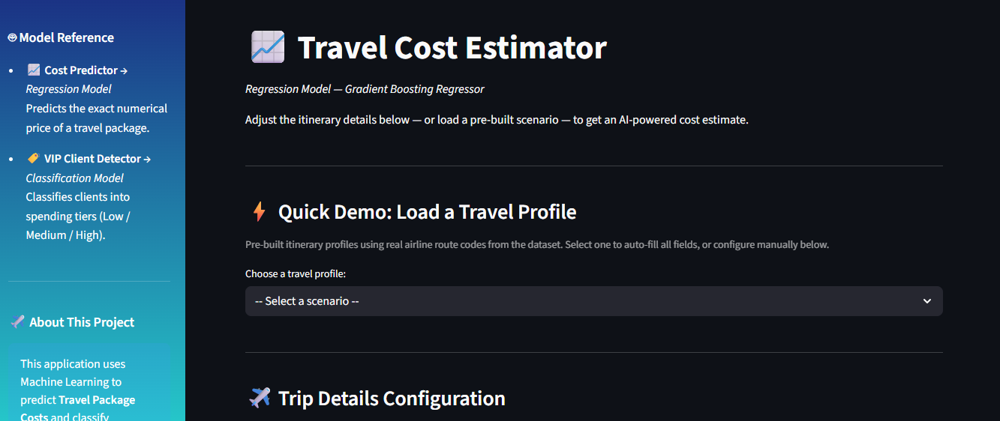
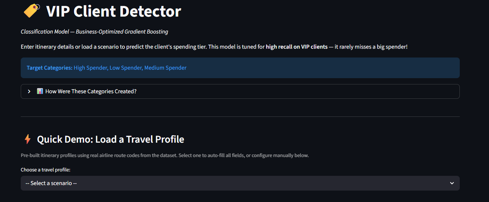
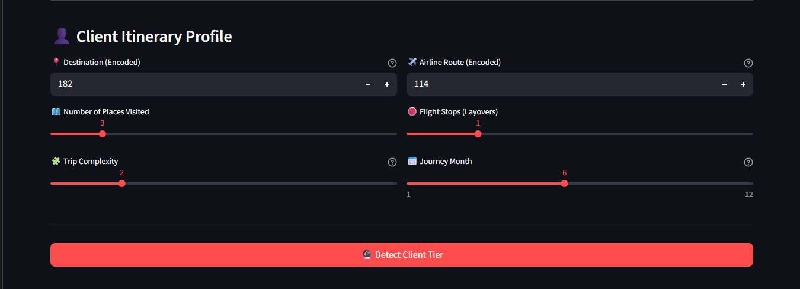
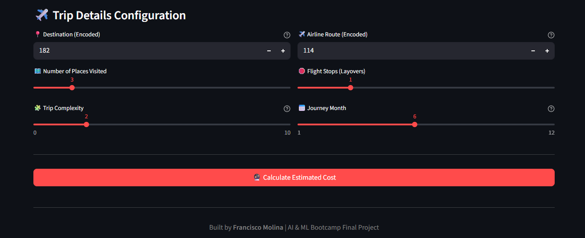
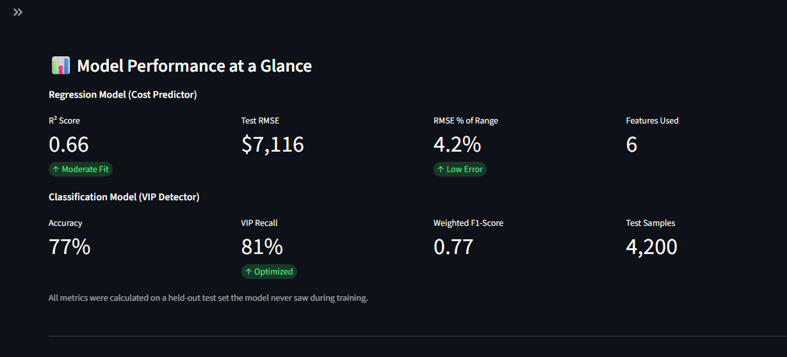
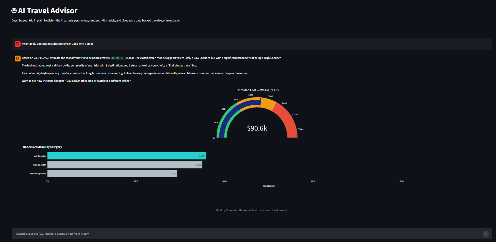

# ✈️ AI Travel Package Predictor

> End-to-end ML pipeline that predicts travel package costs and identifies VIP
> clients — built by a certified travel agent who also writes the code.


[](YOUR_STREAMLIT_URL)

---

## Why this project exists

I run **[Nomaderia](https://nomaderia.vercel.app)** — a bilingual travel-concierge
business serving digital nomads across the Tijuana–San Diego border region. As a
certified travel agent, I quote trip packages manually every week: checking routes,
estimating prices, deciding which clients are worth a premium pitch.

That process is slow and inconsistent. So I built an ML system to automate it.

This is not a generic dataset exercise. Every modeling decision in this project
was informed by how travel pricing actually works and what a travel business
actually needs from a prediction system.

---

## 📋 Table of Contents

- [Problem Statement](#-problem-statement)
- [Dataset](#-dataset)
- [Features Used](#-features-used)
- [Model Performance](#-model-performance)
- [Key Technical Decisions](#-key-technical-decisions)
- [App Features](#-app-features)
- [Screenshots](#-screenshots)
- [Limitations & Future Work](#-limitations--future-work)
- [Tech Stack](#-tech-stack)
- [Project Structure](#-project-structure)
- [How to Run Locally](#-how-to-run-locally)
- [Live Demo](#-live-demo)
- [Author](#-author)

---

## 🎯 Problem Statement

A travel business faces two recurring operational problems:

**1. Pricing inconsistency** — Manual quoting is slow and agent-dependent.
Two agents quoting the same itinerary can land $3,000 apart. A regression
model provides an instant, data-driven baseline that anchors every quote.

**2. Wasted sales effort on the wrong leads** — High-value clients represent
only 14.3% of the customer base but generate disproportionate revenue. Missing
one is expensive. A classification model tuned for maximum recall on that
minority class ensures premium leads are almost never missed.

---

## 📊 Dataset

| Detail | Value |
|--------|-------|
| **Source** | Workation Price Prediction Challenge (MachineHack) |
| **Records** | 20,997 travel itineraries |
| **Target — Regression** | Per Person Price (continuous) |
| **Target — Classification** | Spending tier binned from price: Low / Medium / High |
| **Price range (full)** | $791 – $171,063 |
| **Median price** | $17,766 |
| **Tier distribution** | Low 37.4% · Medium 48.3% · **High 14.3%** ← minority class |

---

## 🔧 Features Used

| # | Feature | Type | Description |
|---|---------|------|-------------|
| 1 | `Destination` | Label Encoded | 565 unique destination route combinations |
| 2 | `Airline` | Label Encoded | 314 unique airline route combinations |
| 3 | `Journey_Month` | Numeric (1–12) | Month of travel |
| 4 | `Num_Places_Visited` | Numeric | Number of stops in the itinerary |
| 5 | `Flight Stops` | Numeric | Number of layovers |
| 6 | `Trip_Complexity` | Engineered | Composite score for itinerary complexity |

---

## 📈 Model Performance

### Regression — Gradient Boosting Regressor

| Metric | Value | Context |
|--------|-------|---------|
| R² Score | **0.66** | Moderate fit; 6 features, high-cardinality encodings |
| Test RMSE | **$7,116** | Against a median price of $17,766 |
| Test MAE | **$4,129** | Typical prediction is off by ~$4K on a ~$18K package |

The model is well-suited for automated tier classification and ballpark quoting.
It is not precise enough to replace final agent review for contract pricing —
a trade-off I address in [Limitations](#-limitations--future-work).

### Classification — Business-Optimized Gradient Boosting

| Metric | Value |
|--------|-------|
| Accuracy | **77%** |
| VIP Recall (High Spender) | **81%** ⭐ |
| Weighted F1-Score | **0.77** |
| Test Samples | 4,200 |

| Class | Precision | Recall | F1 |
|-------|-----------|--------|----|
| High Spender (VIP) | 0.60 | **0.81** | 0.69 |
| Low Spender | 0.80 | 0.86 | 0.83 |
| Medium Spender | 0.81 | 0.68 | 0.74 |

The business objective was to maximize recall on High Spenders — catching 81%
of VIP leads at the cost of some false positives is the right trade-off in a
sales context where a missed premium client is far more expensive than an
over-qualified follow-up.

---

## 💡 Key Technical Decisions

### 1. Class imbalance → `compute_sample_weight`

High Spenders represent only **14.3% of the dataset** (3,001 out of 20,997
records). Without intervention, the classifier would learn to mostly ignore
them. I applied `compute_sample_weight('balanced')` during training to
penalize misclassification of the minority class proportionally to its
underrepresentation. This raised VIP Recall from ~55% (baseline) to **81%**,
directly aligning the model with the business objective.

### 2. High-cardinality categoricals → Label Encoding + tree models

With 565 destination combinations and 314 airline combinations, One-Hot
Encoding would have created ~880 sparse binary columns and dramatically
slowed training. Label Encoding paired with Gradient Boosting — a tree-based
algorithm that handles numeric categorical representations natively — kept
the feature space lean without information loss.

### 3. Bridging model inputs and real-world UX

Deploying a model that expected raw encoded integers (0–564 for destinations)
would make the app unusable in a live demo. I engineered pre-loaded travel
scenarios that map the most frequent real route codes from the dataset to
human-readable buttons (e.g. "Premium Long-Haul — Singapore Airlines"), making
the app presentation-ready without altering the model's expected inputs.

### 4. Cross-model validation

Both models run on the same input simultaneously. The regression output
provides a numerical sanity check for the classification prediction: if the
classifier says "VIP" and the regressor estimates $65,000, that's a consistent
signal. If they contradict each other, it surfaces edge cases worth reviewing.

---

## ✨ App Features

- **Cost Predictor (Regression):** Gauge chart showing where the predicted
  price falls across the budget-to-premium range.
- **VIP Client Detector (Classification):** Probability bar chart with
  model confidence per tier, plus an actionable sales strategy per result.
- **Pre-Loaded Scenarios:** One-click demo profiles (Budget Direct, Emirates
  Multi-City, Singapore Airlines Premium) using real encoded values from the
  dataset.
- **What-If Analysis:** Live delta indicators showing how price changes with
  +1 flight stop, +2 destinations, or +2 complexity.
- **Cross-Model Insight:** Regression and classification run together on
  every input to cross-validate each other.
- **Feature Importance Charts:** Interactive Plotly charts explaining which
  features drive each model's decisions.
- **AI Travel Advisor (LLM + ML):** Describe your trip in plain English —
  the system extracts parameters via Groq/Llama 3.3, runs both ML models,
  and returns a data-backed travel recommendation with interactive charts.

---

## 📸 Screenshots

### Home




### Cost Predictor





### VIP Client Detector





### AI Travel Advisor



---

## ⚠️ Limitations & Future Work

**Limitations I'm aware of:**

- **R² of 0.66** reflects the limited feature set. With only 6 features —
  two of which are high-cardinality label encodings that obscure route-specific
  patterns — the model captures ~66% of price variance. Incorporating flight
  duration, seasonality indices, or accommodation tier would likely push R²
  above 0.80.

- **Classification tiers are derived from the regression target.** The
  Low / Medium / High bins were created by thresholding the price column
  ($0–15K, $15K–30K, >$30K). This means both models solve related versions
  of the same problem. The classification results are interpretable and
  consistent, but they are not an independent validation of the regression
  model.

- **Label Encoding assumes ordinality.** Gradient Boosting handles this well
  in practice, but destination code 400 has no inherently "higher" value than
  code 200. Target encoding or embeddings would be a more principled approach
  for a production system.

- **No temporal features.** Journey month is included, but year and booking
  lead time — two strong price drivers in real travel markets — are not in
  the dataset.

**If I were to extend this project:**

- Add real destination and airline names via a lookup table, replacing the
  raw encoded integers in the UI entirely.
- Train on a multi-year dataset to capture seasonal and post-COVID pricing
  shifts.
- Replace label encoding with target encoding or a learned embedding for
  the high-cardinality categoricals.
- Integrate directly with Nomaderia's quoting workflow via API.

---

## 🛠️ Tech Stack

| Category | Tools |
|----------|-------|
| Language | Python 3.9+ |
| ML Framework | scikit-learn (Gradient Boosting) |
| Web App | Streamlit |
| Data Processing | Pandas, NumPy |
| Visualization | Plotly, Matplotlib, Seaborn |
| Model Persistence | Joblib |
| Deployment | Streamlit Cloud |
| Version Control | Git & GitHub |

---
## 📁 Project Structure

├── app/
│   └── app.py                   # Streamlit web application
├── models/
│   ├── regression_model.pkl     # Trained regression model
│   ├── regression_scaler.pkl
│   ├── regression_features.pkl
│   ├── classification_model.pkl # Trained classification model
│   ├── classification_scaler.pkl
│   ├── label_encoder.pkl
│   ├── classification_features.pkl
│   └── binning_info.pkl         # Bin thresholds: Low ≤$15K, Mid $15–30K, High >$30K
├── notebooks/
│   ├── 01_EDA.ipynb
│   ├── 02_Regression.ipynb
│   └── 03_Classification.ipynb
├── data/
│   └── dataset.csv
├── helpers/
│   └── model_helpers.py
├── screenshots/
├── requirements.txt
└── README.md

---

## 🚀 How to Run Locally

```bash
# 1. Clone the repository
git clone https://github.com/Frankmo89/AI-Travel-Package-Predictor.git
cd AI-Travel-Package-Predictor

# 2. Install dependencies
pip install -r requirements.txt

# 3. Run the app
streamlit run app/app.py
```

---

## 🌐 Live Demo

🔗 **[Try the live app](https://ai-travel-package-predictor.streamlit.app/)**

---

## 👤 Author

**Francisco Molina** — travel agent turned ML engineer.

I founded [**Nomaderia**](https://nomaderia.com), a bilingual
(EN/ES) travel-concierge service for digital nomads operating across
the Tijuana–San Diego border. This project applies ML directly to the
pricing and client-segmentation problems I work with every day.

[](https://github.com/Frankmo89)

---

*MIT License*